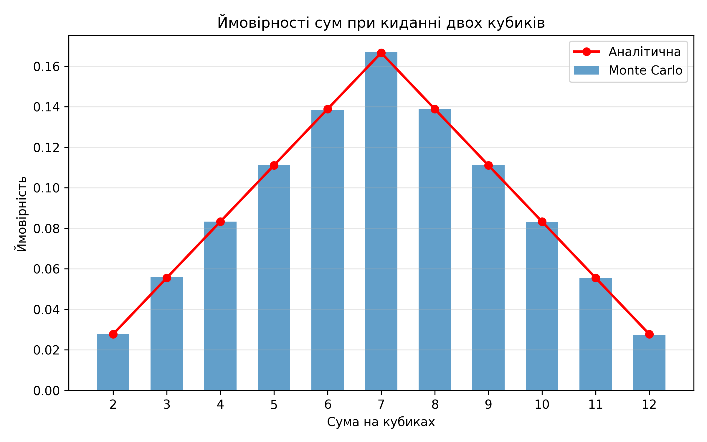

# Завдання 7. Імітація кидків двох кубиків методом Монте-Карло
- Кількість симуляцій: **1,000,000**

| Сума | MC імовірність | Аналітична імовірність |
|:----:|:--------------:|:----------------------:|
|  2  |    2.7726%    |       2.7778%       |
|  3  |    5.6051%    |       5.5556%       |
|  4  |    8.3337%    |       8.3333%       |
|  5  |    11.1355%    |       11.1111%       |
|  6  |    13.8382%    |       13.8889%       |
|  7  |    16.6987%    |       16.6667%       |
|  8  |    13.8849%    |       13.8889%       |
|  9  |    11.1207%    |       11.1111%       |
|  10  |    8.3107%    |       8.3333%       |
|  11  |    5.5474%    |       5.5556%       |
|  12  |    2.7525%    |       2.7778%       |

## Графік

## Висновки
- Імітація методом Монте-Карло добре апроксимує аналітичні ймовірності.
- Похибка зменшується зі збільшенням кількості симуляцій.
- Для найчастішої суми (7) симульована ймовірність найближча до теоретичної.
